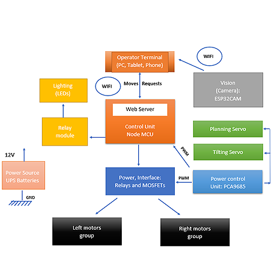

## System Design

### Synoptic diagram

<figure>

</figure>
 * The heart of our rover is a webserver installed on a NodeMCU which communicates with the operator via its WIFI terminal, and assures the movements of the motors through the power interface. Two servos are used to control the orientation of the camera in panning and tilting mode. To assure the vision of the rover, an ESP32-CAM is mounted on top of the support plate. We use a 12V battery to power all components