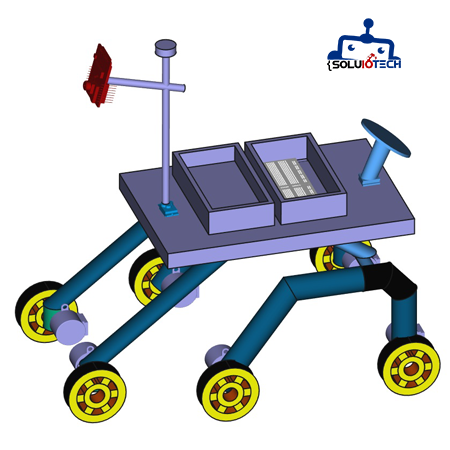
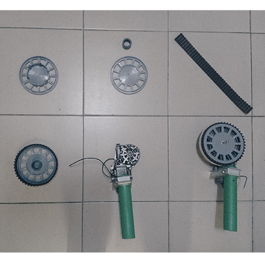
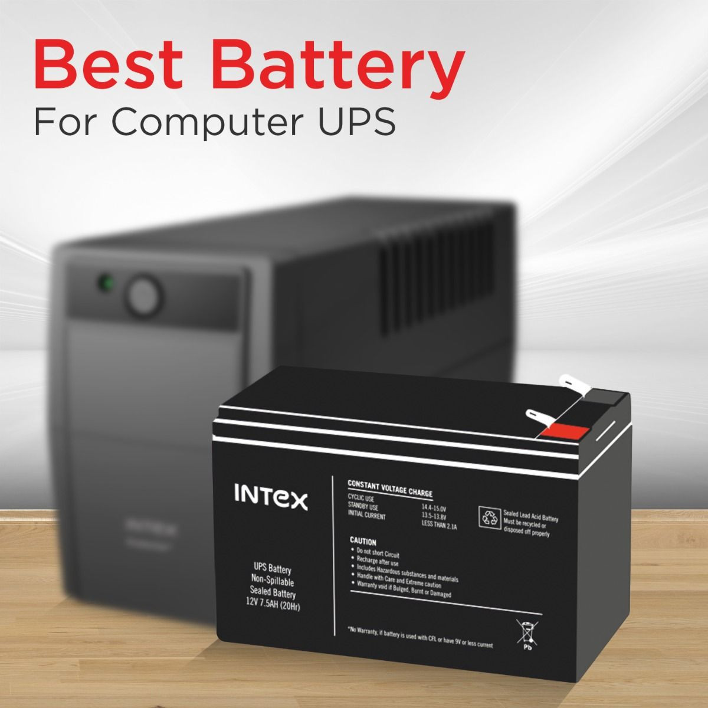

## Mechanical structure

<figure>

</figure>

  * Designed to traverse endless terrains, the lightweight and strong structure used in our rover which comprises of a locomotion sub-system. The body of the rover consists entirely out of PVC pipes, which provide the perfect balance between lightness, strength and flexibility.

  * **Why this choice:**  
  
    We chose PVC pipes because they are easily assembled and also a cheap material to buy, very important on testing project. I opted for car window regulator motors because they offer enough power and are a common resource. Moreover, they are easy to integrate into a hobby robotics design.

## Locomotion

  * Each wheel is driven by a car window regulator motor providing the movement.
    And is mounted with the top of PVC polypropylene siphon 15*15cm and toothed belt to make it all terrain.

  * **Why this choice:**

    We chose PVC polypropylene siphon because of:

    --	Its Lightweight, its Resistance and it’s easy to work with.
    we chose car window regulator motor because: 

    --	Its strength, its high torque, it can work from 5 to 12V, it’s availability, It’s recyclable, low price.
 
    <figure>
    
    </figure>

## Power

  * Such a power subsystem is crucial in order to have the required energy for rover operation. We are presently using just a standard UPS battery of sorts which can provide us with sufficient amount of energy we need, mounted on the rover platform. These can be charged with a standard charger or solar panel mounted on the rover.

  * **Why this choice:**
  
    This use of a readily available battery has the advantage that we can keep costs low, while at the same time providing enough energy capacity to perform testing and initial development phases for our rover

  * **Components used:**

    Rechargeable battery, Power control box

    <figure>
    
    </figure>

