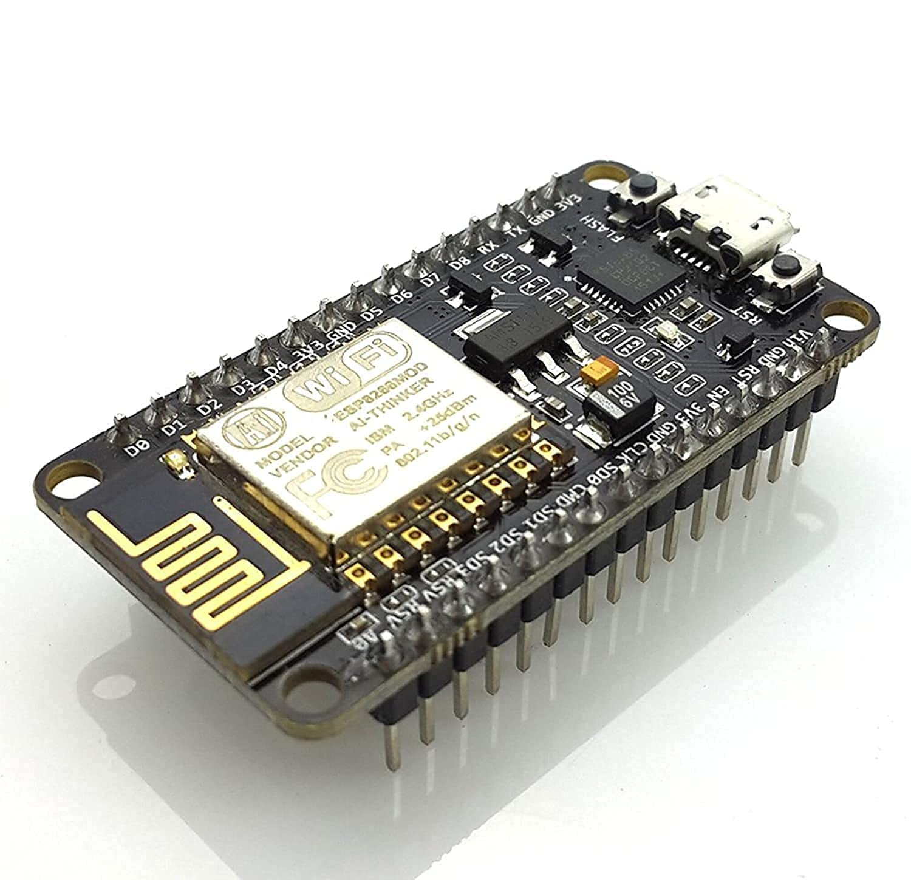
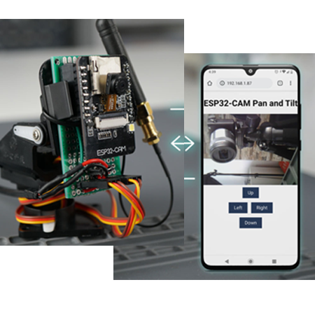
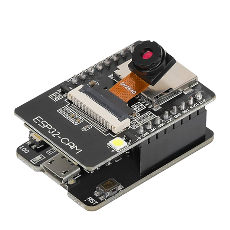

## Communication

  * Communication Subsystem Communicates through a web interface with the rover operator by a WIFI link.

  * **Why this option:**
  
    we chose this technology, because all modern devices have this feature.
    So, we can communicate and control the rover by a PC, smartphone, tablet which all have a navigator. It allows a wireless and unlimited distance control if the rover is connected to internet.

## Processing

  * The control station allows piloting the rover and monitoring its operations from all modern devices or on controller joystick in real-time interaction. To ensure ease of use and efficiency in field operations, we’ve made an intuitive and robust control system based on HTML, CSS, C++, JavaScript.

  * **Why this option:**
  
    It’s more powerfull than Arduino Nano, Mega…, has WIFI integrated, can host a web server, less expensive, available, is widely used for IoT system, consume less.
    A NodeMCU module enables communications with, and remote management of the rover.

  * **Components used:**

    NodeMCU module
    Integrated Wi-Fi antennas
    Control & Monitoring Through Web-based Interface

    <figure>
    
    </figure>

## Control Station

  * The control station allows piloting the rover and monitoring its operations from all modern devices or on controller joystick in real-time interaction. To ensure ease of use and efficiency in field operations, we’ve made an intuitive and robust control system based on HTML, CSS, C++, JavaScript.

  * **Components used:**

    Central computer / Tablet / Phone, Control screens, Joysticks and other controllers

    <figure>
    
    </figure>

## Vision
  * The vision subsystem, is assured by an ESP32-CAM to capture images and videos of the terrain explored by the rover.
  * **Why this choice:**
  
    The ESP32-CAM was the perfect choice, since it’s wireless and has a camera capability together making possible to stream live video via a web interface. 
    Its High-resolution cameras allow for detailed images, crucial for terrain analysis and autonomous navigation of the rover. It’s lightweight, has WIFI and BT, available in Benin, less expensive, powered by 5V source.

    (This makes it way easier to design a system with good and predictable performance.)

    <figure>
    
    </figure>
